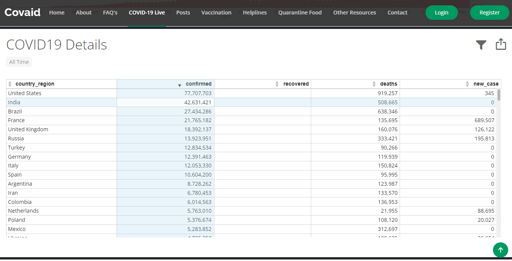

<div id="top"></div>
<!--
*** Thanks for checking out the Best-README-Template. If you have a suggestion
*** that would make this better, please fork the repo and create a pull request
*** or simply open an issue with the tag "enhancement".
*** Don't forget to give the project a star!
*** Thanks again! Now go create something AMAZING! :D
-->


<!-- PROJECT SHIELDS -->
<!--
*** I'm using markdown "reference style" links for readability.
*** Reference links are enclosed in brackets [ ] instead of parentheses ( ).
*** See the bottom of this document for the declaration of the reference variables
*** for contributors-url, forks-url, etc. This is an optional, concise syntax you may use.
*** https://www.markdownguide.org/basic-syntax/#reference-style-links
-->
[![Contributors][contributors-shield]][contributors-url]
[![Forks][forks-shield]][forks-url]
[![Stargazers][stars-shield]][stars-url]
[![Issues][issues-shield]][issues-url]
[![MIT License][license-shield]][license-url]
[![LinkedIn][linkedin-shield]][linkedin-url]


<!-- PROJECT LOGO -->
<br />
<div align="center">
  <a href="https://github.com/ShivamSharma19Ai/COVID-HELP-WEB-APP">
    
  </a>

<h3 align="center">Covaid</h3>

  <p align="center">
    Your <b>One-Stop Hub</b> for all <br>Covid-19 Resources
    <br />
    <a href="https://github.com/ShivamSharma19Ai/COVID-HELP-WEB-APP"><strong>Explore the docs »</strong></a>
    <br />
    <br />
    <a href="https://github.com/ShivamSharma19Ai/COVID-HELP-WEB-APP">View Demo</a>
    ·
    <a href="https://github.com/ShivamSharma19Ai/COVID-HELP-WEB-APP/issues">Report Bug</a>
    ·
    <a href="https://github.com/ShivamSharma19Ai/COVID-HELP-WEB-APP/issues">Request Feature</a>
  </p>
</div>


<!-- TABLE OF CONTENTS -->
<details>
  <summary>Table of Contents</summary>
  <ol>
    <li>
      <a href="#about-the-project">About The Project</a>
      <ul>
        <li><a href="#built-with">Built With</a></li>
      </ul>
    </li>
    <li>
      <a href="#getting-started">Getting Started</a>
      <ul>
        <li><a href="#installation">Installation</a></li>
      </ul>
    </li>
    <li><a href="#highlights-of-our-project">Highlights of our Project</a></li>
    <li><a href="#various-features">Various Features</a></li>
    <li><a href="#contributing">Contributing</a></li>
    <li><a href="#license">License</a></li>
    <li><a href="#contact">Contact</a></li>
    <li><a href="#acknowledgments">Acknowledgments</a></li>
  </ol>
</details>


<!-- ABOUT THE PROJECT -->
## About The Project


<p>Our website, <b>Covaid</b> aims at narrowing down the enormous amount of COVID-19 Resources available to the users and classifying them in an <b>organized</b>, analytical manner. We not only provide users with a <b>detailed & holistic outlook</b> of the resources but also, provide them with a consumer-based experience giving a person in need access to our resources fast & in a <b>Helper-Seeker</b> fashion. <br><br> Apart from that, Our Website is <b>Open-Source</b> based making it an application <b>of the people, by the people & for the people.</b> </p>

<p align="right">(<a href="#top">back to top</a>)</p>


### Built With

* [Bootstrap](https://getbootstrap.com)
* [Flask](https://flask.palletsprojects.com/en/2.0.x/)
* [HTML](https://html.spec.whatwg.org/)
* [CSS](https://www.w3.org/Style/CSS/Overview.en.html)
* [JavaScript](https://javascript.info/)

<p align="right">(<a href="#top">back to top</a>)</p>


<!-- GETTING STARTED -->
## Getting Started

Here are some important steps to get our website up and running locally on your device.


### Installation

1. Fork this GitHub Repository.
2. Open cmd on your device.
3. Go to your specific directory and create a folder for cloning the Github Repository.
4. Clone your forked repo
   ```sh
   git clone https://github.com/yourusername/COVID-HELP-WEB-APP.git
   ```
3. Install the requirements
   ```sh
   pip install -r requirements.txt
   ```
4. Install my-sql requirements
   ```js
   pip install mysql-connector-python
   ```

<p align="right">(<a href="#top">back to top</a>)</p>


<!-- USAGE EXAMPLES -->
## Highlights of our Project

Here is a glimpse of our Web Application <b>Covaid</b> : 





<p align="right">(<a href="#top">back to top</a>)</p>


<!-- ROADMAP -->
## Various Features


- [x] Covid-19 Cases Live Tracker
- [x] Dedicated Posts Section for direct P2P communication
    - [x] Helper-Seeker Option
    - [x] Various Injections & medicines option
- [x] Location-based Vaccination Center Tracker
- [x] State wise Helpline Numbers
- [x] Quarantine based Food Resources & Links
- [x] Links to Other Covid related help websites


<p align="right">(<a href="#top">back to top</a>)</p>


<!-- CONTRIBUTING -->
## Contributing

Contributions are what make the open source community such an amazing place to learn, inspire, and create. Any contributions you make are **greatly appreciated**. 

If you have a suggestion that would make this better, please fork the repo and create a pull request. You can also simply open an issue with the tag "enhancement".
Don't forget to give the project a star! Thanks again!

1. Fork the Project
2. Create your Feature Branch (`git checkout -b feature/AmazingFeature`)
3. Commit your Changes (`git commit -m 'Add some AmazingFeature'`)
4. Push to the Branch (`git push origin feature/AmazingFeature`)
5. Open a Pull Request

<p align="right">(<a href="#top">back to top</a>)</p>


<!-- LICENSE -->
## License

Distributed under the MIT License. See `LICENSE.txt` for more information.

<p align="right">(<a href="#top">back to top</a>)</p>


<!-- CONTACT -->
## Contact

Shivam Sharma - [@shivamsharma](https://www.linkedin.com/in/shivam-sharma-bbab16210/) - shivam.sharma19sept@gmail.com

Siddhartha Sharma - [@iamsiddharthasharma](https://www.linkedin.com/in/iamsiddharthasharma/) - siddhartha.sharma9@gmail.com

Project Link: [https://github.com/ShivamSharma19Ai/COVID-HELP-WEB-APP](https://github.com/ShivamSharma19Ai/COVID-HELP-WEB-APP)

<p align="right">(<a href="#top">back to top</a>)</p>


<!-- ACKNOWLEDGMENTS -->
## Acknowledgments

* [domo.com (Covid-19 Live Tracker)](https://www.domo.com/covid19/embed-visualizations/)
* [mapmyindia.com (Vaccination Tracker)](https://maps.mapmyindia.com/)
* [mygov (Helplines)](https://www.mohfw.gov.in/)

<p align="right">(<a href="#top">back to top</a>)</p>


<!-- MARKDOWN LINKS & IMAGES -->
<!-- https://www.markdownguide.org/basic-syntax/#reference-style-links -->
[contributors-shield]: https://img.shields.io/github/contributors/ShivamSharma19Ai/COVID-HELP-WEB-APP.svg?style=for-the-badge
[contributors-url]: https://github.com/ShivamSharma19Ai/COVID-HELP-WEB-APP/graphs/contributors
[forks-shield]: https://img.shields.io/github/forks/ShivamSharma19Ai/COVID-HELP-WEB-APP.svg?style=for-the-badge
[forks-url]: https://github.com/ShivamSharma19Ai/COVID-HELP-WEB-APP/network/members
[stars-shield]: https://img.shields.io/github/stars/ShivamSharma19Ai/COVID-HELP-WEB-APP.svg?style=for-the-badge
[stars-url]: https://github.com/ShivamSharma19Ai/COVID-HELP-WEB-APP/stargazers
[issues-shield]: https://img.shields.io/github/issues/ShivamSharma19Ai/COVID-HELP-WEB-APP.svg?style=for-the-badge
[issues-url]: https://github.com/ShivamSharma19Ai/COVID-HELP-WEB-APP/issues
[license-shield]: https://img.shields.io/github/license/ShivamSharma19Ai/COVID-HELP-WEB-APP.svg?style=for-the-badge
[license-url]: https://github.com/ShivamSharma19Ai/COVID-HELP-WEB-APP/LICENSE.txt
[linkedin-shield]: https://img.shields.io/badge/-LinkedIn-black.svg?style=for-the-badge&logo=linkedin&colorB=555
[linkedin-url]: https://www.linkedin.com/in/iamsiddharthasharma/
[product-screenshot]: images/screenshot.png
